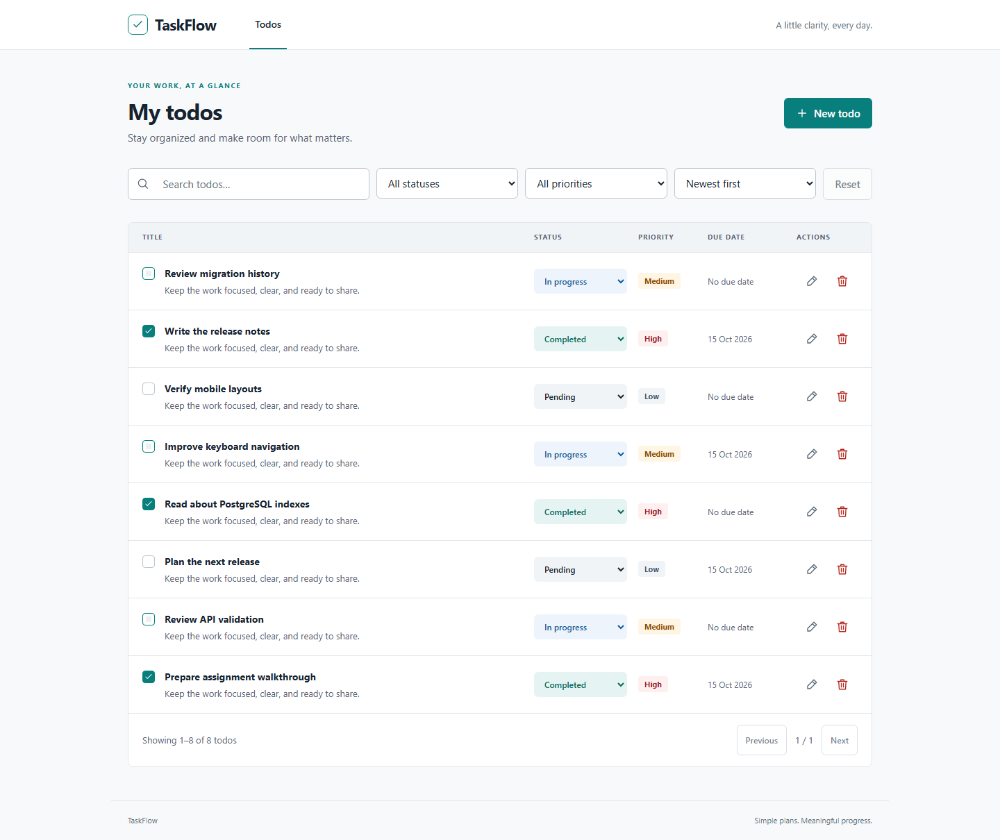

# TaskFlow

[](https://github.com/MithunKumar09/taskflow-todo-mpa/actions/workflows/ci.yml)

A focused Todo application with a genuine React/Vite multi-page frontend and a Fastify API backed by PostgreSQL. Neutral surfaces, compact controls, and a restrained teal accent keep tasks easy to scan on desktop and mobile.

## Live Demo

**Application:** [Open TaskFlow](https://taskflow-mpa.onrender.com)

The live demo uses free-tier hosting. The API may take a short moment to resume after extended inactivity.

Production request path: Browser → Render Static Site (React/Vite MPA) → Render Web Service (Fastify API) → Neon PostgreSQL.

**Source:** [GitHub repository](https://github.com/MithunKumar09/taskflow-todo-mpa)

## Features

- Create, read, edit, complete, reopen, and delete todos.
- Case-insensitive title search, status/priority filters, four stable sorts, and pagination.
- Independent list and detail HTML documents, including direct detail refresh.
- Loading skeletons, empty/error states, explicit retry, and duplicate-submission protection.
- Accessible forms/dialogs, visible focus, responsive layouts, and automated axe checks.
- Strict validation, database constraints, safe correlated errors, security headers, rate limits, and graceful shutdown.

## Application screenshots

Captured from the running application with demo data:

[Watch/download the 5:44 captioned walkthrough](docs/assets/taskflow-walkthrough.webm). It shows actual UI/MPA behavior, real Postman output, captured verification results, migrations, documentation, and green CI. Captions provide the explanation; the recording has no voice narration.



[Mobile list](docs/assets/todo-list-mobile.png) · [Todo detail](docs/assets/todo-detail-desktop.png) · [Create dialog](docs/assets/create-dialog.png)

## Stack

Node **24 LTS**, TypeScript, npm workspaces, React 19, Vite 8, Fastify 5, PostgreSQL 17, Prisma **7** with its PostgreSQL adapter, Zod 4, Vitest, Playwright Chromium, axe, and Postman/Newman. The lockfile determines exact versions.

## Run locally

Install Node 24, npm, and Docker Desktop with Linux containers. From the repository root:

```powershell
Copy-Item .env.example .env
npm ci
npm run env:check
npm run db:validate
npm run db:generate
docker compose --profile test up -d --wait
npm run db:deploy
npm run db:test:deploy
npm run dev
```

Open **http://localhost:5173**. The API listens on **http://127.0.0.1:3000**. Vite proxies `/api` and `/health` in development and preview. Database configuration is never bundled into the browser.

| Variable     | Purpose                                                    |
| ------------ | ---------------------------------------------------------- |
| `NODE_ENV`   | development, test, or production                           |
| `API_PORT`   | API listen port, default 3000                              |
| `WEB_ORIGIN` | Exact permitted HTTP(S) origin without path/trailing slash |

Database connection variables are listed in [.env.example](.env.example). Configure separate development and disposable test databases; the test database name must end in `_test`. Production database credentials belong only in the backend environment.

The deployed frontend uses `VITE_API_BASE_URL=https://taskflow-api-q0tp.onrender.com` in its build environment. Rebuild/redeploy the static site after changing it. Local development and tests can omit it or leave it empty to keep relative `/api` requests. The Vite configuration reads this public setting from the process environment first, then the root `.env`. All `VITE_*` values are client-visible: never use them for database URLs/passwords, API secrets, private tokens, or keys.

Compose binds PostgreSQL to loopback ports **55432** (development) and **55433** (test). Local example credentials are development-only. Development uses a named volume; test data is temporary. `docker compose down` preserves the development volume. Reapply test migrations after recreating the test container.

For a compiled local run:

```powershell
npm run build
npm run start
# In a second terminal:
npm run preview
```

Optional demo data: `npm run db:seed`. Stable IDs and empty upsert updates preserve edits to existing seeded records.

## Verify

```powershell
npm run lint
npm run typecheck
npm run test:unit
npm run test:integration
npm run build
npx playwright install chromium
npm run test:e2e
# With the local API running:
npm run postman:test
```

Browser certification runs built assets and the compiled API on dedicated ports **5174/3100**, resets only Todo records in the guarded test database, and refuses existing development servers. See [testing and evidence](docs/TESTING.md).

Import [the Postman collection](postman/TaskFlow.postman_collection.json) and [local environment](postman/Local.postman_environment.json), then run in order. The collection creates and deletes its own uniquely named record while preserving other todos.

## Genuine MPA and backend boundaries

`apps/web/index.html` and `apps/web/todo/index.html` mount independent React entries. Title links are ordinary anchors to `/todo/?id=<uuid>`; there is no client router. Both HTML documents are emitted. Playwright verifies a successful browser **document request** on navigation and another on refresh.

The modular monolith follows routes → controllers → services → repositories. One atomic PATCH update maintains status and completion time. Editing uses last-write-wins: explicit COMPLETED writes its timestamp, reopening clears it, and unrelated edits preserve it.

Read [architecture](docs/ARCHITECTURE.md), [API contracts](docs/API.md), and the [5–7 minute reviewer demo](docs/DEMO.md).

## Scope and decisions

This shared assignment/demo app has no accounts or authentication. Swagger, cross-browser certification, and concurrency stress checks remain optional. The API binds to loopback locally and all interfaces in production, with the permitted frontend origin controlled by `WEB_ORIGIN`.

Approved local reference PNGs guide appearance and are ignored from Git. They are never screenshot baselines. Visual regression is separate and remains gated until the actual UI is accepted. Published screenshots must come from the application and live under `docs/assets/`.

Local specification/reference/audit/plan inputs are specifically ignored; substantive Markdown is publishable without a global allowlist. CI certifies lint, types, real PostgreSQL tests, build, Chromium, and Postman.

AI assistance: Codex assisted implementation, documentation, and verification. Running application evidence and actual test results govern completion; generated references do not substitute for runtime checks.
