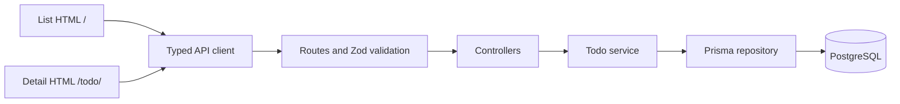

# Architecture

## Boundaries

TaskFlow is an npm-workspace modular monolith. `apps/api` owns persistence/domain rules and `apps/web` owns presentation. The boundary is versioned JSON DTOs, independent of Prisma models.

`app.ts` constructs dependencies and owns lifecycle hooks; `server.ts` owns listening and signals. Routes validate params/query/body before controllers choose HTTP status and envelopes. Services enforce completion behavior; repositories perform Prisma operations and translate expected missing-row failures.

## Persistence

The initial migration defines UUID IDs, status/priority enums, title/description bounds, timezone-aware millisecond timestamps, and CHECK constraints for nonblank titles and completion consistency. Prisma generates IDs and maintains updatedAt; API timestamps are UTC ISO strings.

Indexes support creation ordering, common status/priority filters, and due-date sorting. Search uses case-insensitive substring matching. Page and count queries are independent reads, so metadata can drift slightly during concurrent writes. Offset pagination is proportionate to this assignment; there is no snapshot guarantee or search infrastructure.

Priority enum declaration order LOW/MEDIUM/HIGH supports descending semantic order. Creation sorts break ties by UUID in the same direction. Due dates use ascending order, nulls last, UUID ascending. Priority sorts add newest creation and UUID descending tie-breakers.

## Last-write-wins completion

One Prisma update writes supplied mutable fields atomically. Explicit COMPLETED writes the operation's completion timestamp; explicit PENDING/IN_PROGRESS clears it. Omitted status leaves both fields untouched. Edit forms submit changed fields only. A repeated explicit COMPLETED operation records a new timestamp.

There are no version tokens, Serializable transactions, locks, or conflict-retry loops. PostgreSQL constraints prevent inconsistent completion state. Prisma P2025 on update/delete becomes a domain 404; other failures become safe 500 responses.

## MPA and async ownership

Vite builds separate list/detail HTML documents with independent React mounts and shared bundles. Normal anchors load detail. Detail validates the query ID before calling the API; valid unknown IDs use the real API 404. Future hosting must serve the emitted detail document at /todo/ rather than relying on an SPA fallback.

Read hooks own AbortControllers and sequence counters. Superseded reads cannot commit stale results even if they resolve later. Unmount aborts reads. Search debounce owns a cleaned-up 300ms timer; filter changes reset pagination. Existing data remains visible while refetching.

Mutation hooks register an operation key synchronously before awaiting transport, preventing duplicate operations before React renders. Pending controls/dialogs are locked. Requests have timeouts and unmount cancellation; uncertain writes are never automatically retried. Successful mutations invalidate old reads before authoritative refetch. Deleting the last item reconciles pagination.

## Security, errors, and lifecycle

Environment validation precedes startup. Fastify owns one bounded PostgreSQL pool with connection/statement timeouts and disconnects it on close. Startup connects before listening. Health performs a database probe and returns safe 503 when unavailable.

Server-generated request IDs appear in headers and error bodies. Unexpected failures are logged while responses omit SQL, secrets, and stacks. Helmet, exact-origin CORS, 64KiB body limits, strict Zod schemas, UUID validation, parameterized queries, and Todo per-IP limits provide the baseline. Forwarded IPs are not trusted; health is exempt. Browser content uses React text escaping.

Fastify/Pino logs request completion and duration with sensitive header redaction. Guarded SIGINT/SIGTERM handlers close Fastify and Prisma; a 15-second deadline bounds shutdown. Failed startup closes resources and exits unsuccessfully.

## UX/accessibility

Central tokens govern neutral surfaces, graphite text, teal actions/focus, spacing, and control sizing. Desktop lists become stacked mobile rows. Long content wraps; dialogs scroll within the viewport. Native modal dialogs have explicit initial focus, restoration, Escape handling, validation focus, and submission locks.

Keyboard/focus tests complement axe scans of list/detail/create/edit states; native markup alone does not certify accessibility. Human visual review remains separate. Accounts, realtime listeners, queues, and distributed caches are outside scope.

## Migrations and rollback

Author future migrations with db:migrate, commit them, and deploy with db:deploy. Tests apply the same committed migrations through a separately guarded URL. Use ordinary revert commits for application rollback and corrective forward migrations to preserve data. No destructive automatic down/reset command exists. Back up before future destructive migrations and preserve Git history.
